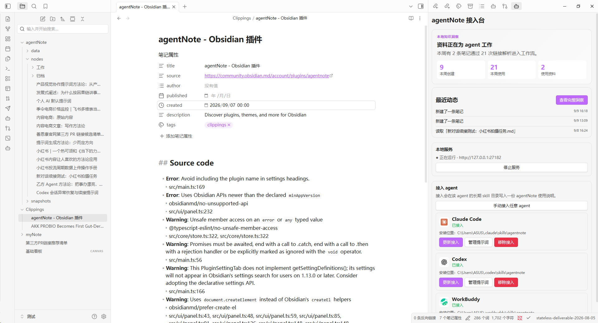
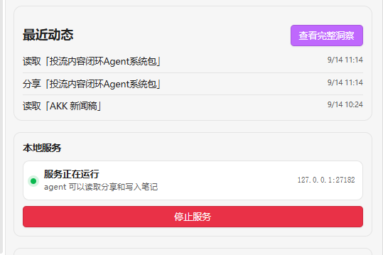
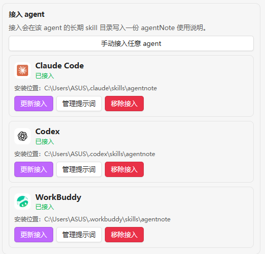

# agentNote

Share local Obsidian notes and files with AI agents through a private, local-only HTTP service.

> 中文说明：[README.zh-CN.md](README.zh-CN.md)

agentNote is an Obsidian desktop plugin that connects your vault with agents such as Claude Code, Codex, and WorkBuddy. You choose what an agent can read, and the plugin creates a live local URL that always resolves to the current content.

<p align="center">
  
  <br>
  <sub>Local knowledge activity and agent connections, inside Obsidian.</sub>
</p>

## Features

- Share a note, file, folder, or selected text with an agent.
- Include background context so the agent understands what the shared material is and why it matters.
- Let an agent create and update Markdown notes in your vault through natural language.
- Keep share links live: updated files resolve to their latest content.
- Show Claude Code, Codex, and WorkBuddy in the connection panel even when they are not installed.
- Open the official website for an agent that is not detected locally.
- Explore a local knowledge profile with reuse rankings, contribution history, activity, and archive suggestions.
- Generate a privacy-aware PNG summary of your knowledge activity for sharing.

## Start in 3 minutes

Read the illustrated [How to Use guide](docs/How%20to%20Use.md) for the complete first workflow. The short version is:

1. Open the **agentNote connection panel** and confirm that the local service is running.
2. Connect one detected agent, then restart that agent once.
3. Right-click a vault file or folder, choose **agentNote: Share with agent**, and paste the copied link into the conversation.
4. Ask the connected agent to read the link, or simply say “Write this to Obsidian.”

<p align="center">
  
  
  <br>
  <sub>Start the local service, connect one agent, then share a file from Obsidian.</sub>
</p>

## Installation

### From the Obsidian Community Plugins directory

1. Open **Settings → Community plugins** in Obsidian.
2. Search for `agentNote`.
3. Install and enable the plugin.
4. Open the **agentNote connection panel** and confirm that the local service is running.

### Manual installation

1. Download `main.js`, `manifest.json`, and `styles.css` from the [latest GitHub release](https://github.com/xinxinrana/agentNote-Obsidian-/releases/latest).
2. Create `.obsidian/plugins/agentnote/` inside your vault.
3. Copy the three files into that folder.
4. Restart Obsidian or reload the plugin from **Settings → Community plugins**.

## Basic usage

### Share content with an agent

- Right-click a file or folder and choose **agentNote: Share with agent**.
- Select text in the editor and use **agentNote: Share selected content**.
- Send the copied local URL to your agent.

The response includes the current content, its background, the local file path, and instructions for reading or editing the original file.

### Write notes from an agent

After connecting an agent, say one of the following:

- “Write this to Obsidian.”
- “Save this to my agent notes.”
- “Remember this in my notes.”

The agentNote skill asks the agent to create a title, body, background, and tags, then write the result to the vault. The agent receives a permanent local link that can be used for later updates.

### Connect an agent

Open the agentNote connection panel. Detected agents can be connected or updated directly. If an agent is not installed, use **Open official website** to install it first. You can also use **Connect any agent manually** for an agent that is not listed.

## Local service and privacy

- The service listens on `127.0.0.1` by default, usually at `http://127.0.0.1:27182`.
- It is available only while Obsidian is running.
- Vault contents are not uploaded to agentNote's servers.
- There is no account, cloud sync, telemetry service, or public sharing layer.
- The plugin uses local filesystem access and the system clipboard for its sharing and agent integration features.
- This is a desktop-only plugin because it uses Node.js, Electron, and a local HTTP server.

## Documentation

| Chinese primary document | English copy |
| --- | --- |
| [How to Use agentNote](docs/如何使用.md) | [How to Use agentNote](docs/How%20to%20Use.md) |
| [Features and Usage](docs/功能与使用.md) | [Features and Usage](docs/Features%20and%20Usage.md) |
| [Product Design](docs/product-design.md) | [Product Design](docs/Product%20Design.md) |
| [Product Overview PDF](docs/agentNote：让本地%20Obsidian%20内容直接流向%20AI%20agent.pdf) | [Product Overview PDF](docs/agentNote%20-%20Local%20Obsidian%20Knowledge%20for%20AI%20Agents.pdf) |
| [Obsidian Community Listing Guide](docs/官方社区市场上架流程.md) | [Obsidian Community Listing Guide](docs/Obsidian%20Community%20Listing%20Guide.md) |

## Development

```powershell
npm install
npm run typecheck
npm run build
node test/e2e.mjs
```

The build produces the Obsidian plugin bundle in `main.js` and the Node-compatible core test bundle in `test/core-bundle.cjs`.

## License

agentNote is released under the [MIT License](LICENSE).

## Author

Evan · [GitHub](https://github.com/xinxinrana)
