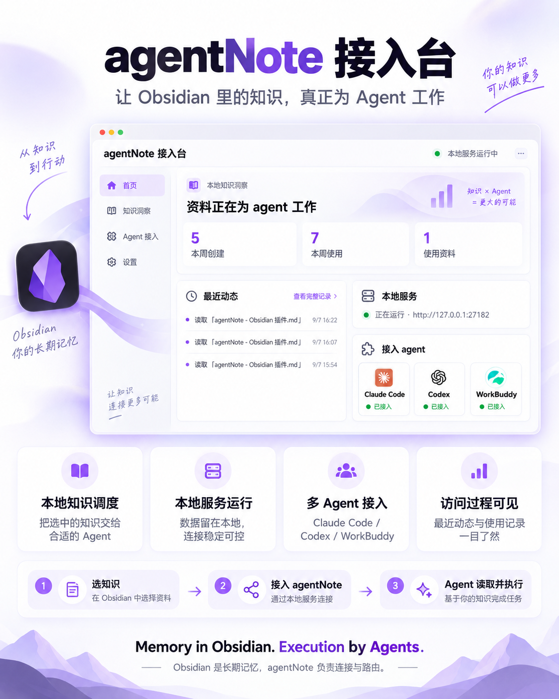

# agentNote

让本地 Obsidian 笔记和文件通过私有、仅本机可访问的 HTTP 服务，直接交给 AI agent 使用。

> English version: [README.md](README.md)

agentNote 是一个 Obsidian 桌面端插件，可连接 Claude Code、Codex、WorkBuddy 等 agent。你选择一份资料，插件会生成始终返回最新内容的本地地址；agent 产生的成果也能自然写回你的 vault。

<p align="center">
  
  <br>
  <sub>在 Obsidian 内查看本地知识活动，并管理 agent 接入。</sub>
</p>

## 核心能力

- 分享笔记、文件、文件夹或选中文本给 agent。
- 附带背景信息，让 agent 知道资料是什么、从哪来、为什么重要。
- 让 agent 通过自然语言新建或更新 vault 内的 Markdown 笔记。
- 保持分享地址实时有效：原文件更新后，同一地址自动返回最新内容。
- 即使未安装，也始终展示 Claude Code、Codex 和 WorkBuddy，并提供官网入口。
- 用本地知识档案查看复用、活动、贡献与整理建议。
- 生成可匿名展示的知识活动 PNG 分享图。

## 三分钟开始

完整图文步骤见 [如何使用 agentNote](docs/如何使用.md)。简版流程如下：

1. 打开 **agentNote 接入台**，确认本地服务正在运行。
2. 接入一个已检测到的 agent，然后重启该 agent 一次。
3. 在 vault 文件或文件夹上右键，选择 **agentNote: 分享给 agent**，把复制的地址粘贴到对话里。
4. 请已接入的 agent 读取地址，或直接说“写到 Obsidian”。

<p align="center">
  
  
  <br>
  <sub>启动本地服务，接入一个 agent，然后从 Obsidian 分享资料。</sub>
</p>

## 安装

### 从 Obsidian 社区插件目录安装

1. 在 Obsidian 打开 **设置 → 第三方插件**。
2. 搜索 `agentNote`。
3. 安装并启用插件。
4. 打开 **agentNote 接入台**，确认本地服务正在运行。

### 手动安装

1. 从[最新 GitHub Release](https://github.com/xinxinrana/agentNote-Obsidian-/releases/latest)下载 `main.js`、`manifest.json` 和 `styles.css`。
2. 在 vault 内创建 `.obsidian/plugins/agentnote/`。
3. 将三个文件复制到该目录。
4. 重启 Obsidian，或在 **设置 → 第三方插件** 中重新加载插件。

## 基础使用

### 分享资料给 agent

- 右键文件或文件夹，选择 **agentNote: 分享给 agent**。
- 在编辑器中选中文本，使用 **agentNote: 分享选中文本**。
- 把自动复制的本地地址发给 agent。

地址会返回当前内容、背景、本机文件路径以及读取或编辑原文件的提示。

### 让 agent 写笔记

接入 agent 后，直接说：

- “写到 Obsidian。”
- “写到 agent 笔记。”
- “记到笔记里。”

agent 会整理标题、正文、背景与标签，并写入 vault。写入成功后会获得一条可供后续更新的永久本地地址。

### 接入 agent

打开 **agentNote 接入台**。已检测到的 agent 可直接接入或更新；未安装时可点击 **前往官网安装**。不在列表中的 agent 可使用 **手动接入任意 agent**。

## 本地服务与隐私

- 服务默认监听 `127.0.0.1`，通常是 `http://127.0.0.1:27182`。
- 仅在 Obsidian 运行时可用。
- vault 内容不会上传到 agentNote 服务器。
- 不包含账号、云同步、遥测或公网分享层。
- 插件使用本地文件系统与系统剪贴板完成分享和 agent 接入。
- 由于依赖 Node.js、Electron 和本地 HTTP 服务，仅支持桌面端。

## 文档

| 中文主文档 | 英文副本 |
| --- | --- |
| [如何使用 agentNote](docs/如何使用.md) | [How to Use agentNote](docs/How%20to%20Use.md) |
| [功能与使用说明](docs/功能与使用.md) | [Features and Usage](docs/Features%20and%20Usage.md) |
| [核心产品设计](docs/product-design.md) | [Product Design](docs/Product%20Design.md) |
| [产品介绍 PDF](docs/agentNote：让本地%20Obsidian%20内容直接流向%20AI%20agent.pdf) | [Product Overview PDF](docs/agentNote%20-%20Local%20Obsidian%20Knowledge%20for%20AI%20Agents.pdf) |
| [官方社区市场上架流程](docs/官方社区市场上架流程.md) | [Obsidian Community Listing Guide](docs/Obsidian%20Community%20Listing%20Guide.md) |

<details>
<summary><strong>产品视觉概览</strong></summary>

<br>

<p align="center">
  
</p>

<p align="center">
  
</p>

</details>

## 开发

```sh
npm ci
npm test
```

构建会生成 Obsidian 插件包 `main.js`，以及 Node 兼容核心测试包 `test/core-bundle.cjs`。

开发命令支持 macOS、Windows 和 Linux。`npm test` 依次执行类型检查、构建和核心端到端测试，不会部署到 vault。使用 `npm run dev` 可持续监听代码并重新构建。

部署到本地测试 vault 时，明确指定已有目录（路径有空格时加引号）：

```sh
npm run deploy:test -- "/absolute/path/to/test-vault"
```

开发环境使用 Node.js 22 或更新版本。也可在项目根目录的 `.env.local` 中保存 `AGENTNOTE_TEST_VAULT="/absolute/path/to/test-vault"`，之后直接运行 `npm run deploy:test`。该本地文件已被 Git 忽略；命令行路径优先于环境变量，已有环境变量优先于 `.env.local`。追加 `--dry-run` 可检查部署位置而不写入文件。

默认插件配置目录为 `.obsidian`；如有自定义目录，追加 `--config-dir .obsidian-test`。部署会覆盖该目录下 agentNote 的三个插件文件，完成后在 Obsidian 中重新加载插件。

## 许可证

agentNote 使用 [MIT License](LICENSE) 发布。

## 作者

Evan · [GitHub](https://github.com/xinxinrana)
