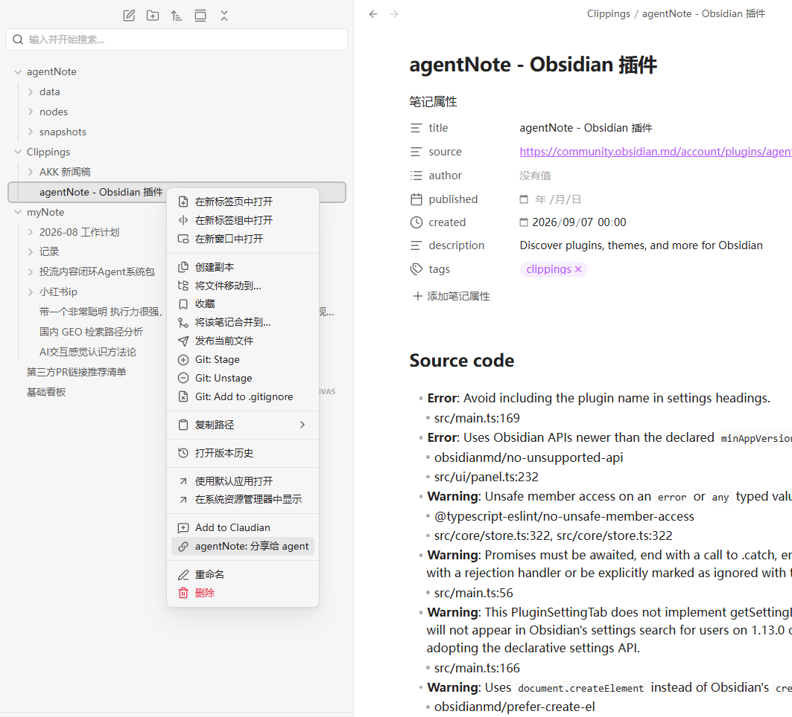
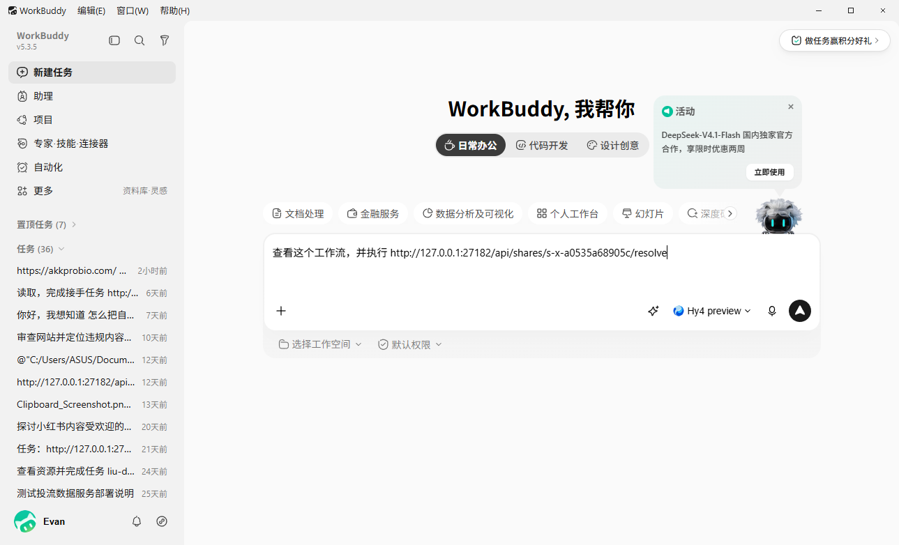
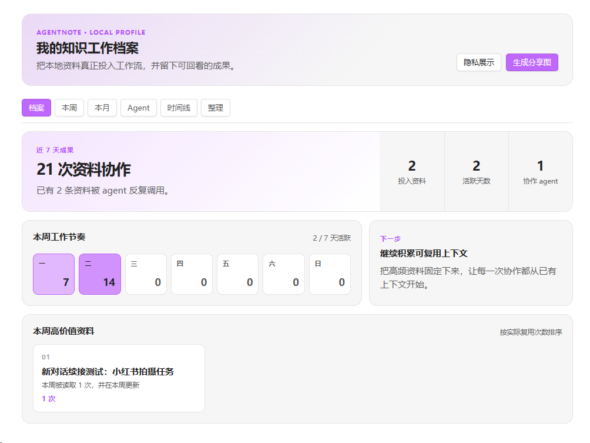

# agentNote 功能与使用

> English copy: [Features and Usage](Features%20and%20Usage.md)

## 先理解一件事

agentNote 不是另一套云笔记，也不接管你的文件。它只在 Obsidian 运行时启动一个本地服务，让 vault 内容有一个 agent 可以直接读取的地址。

所以它解决的是这件事：本地资料交给 agent 时，不再靠复制路径、上传文件、粘贴内容和反复解释上下文。

<p align="center">
  
  <br>
  <sub>在 Obsidian 内查看本地知识洞察，并接入需要协作的 agent。</sub>
</p>

## 三分钟开始

第一次使用只需要完成这三步：

1. 打开右侧 **agentNote 接入台**，确认“本地服务”显示绿色状态灯和“服务正在运行”。
2. 在“接入 agent”中选择一个已安装的 agent，点击 **接入 agentNote**，然后重启该 agent 一次。
3. 在文件列表中右键一份资料，选择 **agentNote: 分享给 agent**，把自动复制的地址粘贴到对话里，并告诉 agent 你希望它完成什么工作。

可以直接使用这句话开始：

> 请读取这个资料，整理重点、待办和风险：<粘贴 agentNote 地址>

<p align="center">
  
  
  <br>
  <sub>先确认服务运行，再接入一个 agent。</sub>
</p>

完整英文图文指南见 [How to Use agentNote](How%20to%20Use.md)；三分钟中文教程见 [如何使用 agentNote](如何使用.md)。

## 一、分享本地内容

### 分享文件或文件夹

在 Obsidian 文件列表中右键目标，选择 **agentNote: 分享给 agent**。地址会自动复制到剪贴板，直接发给 agent。

<p align="center">
  
  <br>
  <sub>不需要上传文件或复制内容；分享地址始终指向当前版本。</sub>
</p>

agent 会按对象类型获得合适的信息：

| 对象 | 返回内容 |
|---|---|
| 文件 | 文件地址、文件背景、当前文件内容 |
| 文件夹 | 文件夹地址、文件夹背景、第一层文件和子文件夹名称 |

文件夹不会自动展开所有层级，避免把不相关的目录内容一次性交给 agent。

### 分享选中文本

在编辑器内选中一段内容，使用命令面板中的 **agentNote: 分享选中内容**，或右键编辑器菜单中的同名操作。地址同样会复制到剪贴板。

### 地址如何使用

把复制出的地址完整发给 agent，例如：

```text
请读取这个资料并给我总结：
http://127.0.0.1:27182/api/shares/s-xxxx/resolve
```

已接入 agentNote 的 agent 会直接读取它。地址代表当前内容：文件修改后无需重新创建或重新发送地址。

<p align="center">
  
  <br>
  <sub>粘贴地址后，补充你希望 agent 完成的具体工作。</sub>
</p>

地址的返回中始终附带内容在本机的真实路径。读取优先走地址；需要修改时，具备本地文件能力的 agent 会直接对原文件做局部编辑，改完后地址内容自动更新，无需重新分享。

## 二、让 agent 写笔记

先在接入台完成 agent 接入。之后可以直接使用自然语言：

- “写到 Obsidian。”
- “写到 agent 笔记。”
- “记到笔记里。”

也可以补充你希望的内容：

> 把下面的调研结论记到笔记里，标题是“竞品访谈”，标签用“调研、2026Q3”，背景写明它来自今天的用户访谈。

agent 会根据对话整理标题、正文、背景和标签。背景用于说明"这是什么、从哪来、为什么保存"；不确定时可以留空。

写入成功后，agent 会拿到这条笔记的永久地址并反馈给你。之后想修改，直接说"修改刚才那篇"：agent 会用这个地址找到原笔记并更新它，不会找不到，也不会新建一条重复笔记。

## 三、接入 agent

打开 Obsidian 右侧的 **agentNote 接入台**，在“接入 agent”区域操作。

### 已识别的 agent

Claude Code、Codex、WorkBuddy 出现在列表中时：

1. 点击 **接入 agentNote**。
2. agentNote 会把使用说明写入该 agent 的长期 skill 目录。
3. 重启对应 agent，让它加载新 skill。
4. 现在可以直接说“写到笔记里”，或把 agentNote 分享地址发给它。

需要修改接入说明时，点击 **管理提示词**。先查看当前完整内容；点击 **解锁编辑** 后，确认风险才可修改。保存并更新安装后，内容会重新锁定。原有附加要求会一并保留在完整提示词中。不同 agent 的缓存机制不同，保存后可能需要重启 agent 或新开对话。

### 手动接入任意 agent

没有出现在列表中的 agent，点击 **手动接入任意 agent**，复制生成的安装任务并发送给目标 agent。

这段任务会要求目标 agent：

- 自己识别其长期 skill、instruction 或工具说明机制
- 验证 agentNote 本地服务是否可用
- 创建可在后续会话自动加载的 agentNote 说明
- 最后报告安装位置和验证结果

### 移除接入

点击 **移除接入**，确认后只会删除该 agent 的 agentNote `SKILL.md`。该 agent 的其它 skill、配置、历史对话和文件不会被删除。

### 反馈与建议

在接入台底部点击 **作者 Evan · 反馈**。先在插件内填写结构化内容；插件会复制反馈，并在系统默认浏览器打开预填的 GitHub Issue。GitHub 登录由浏览器中的用户账户处理。

## 四、归档笔记

归档是为了让常用工作区保持干净。归档后，笔记会移入 vault 内的归档文件夹；它仍然保留，可以继续分享，也可以随时移回常用区。

归档不是删除，也不会让已有分享地址失效。

## 五、知识洞察与分享

打开接入台中的 **查看完整洞察**，可以回看本地资料如何进入 agent 工作流。洞察不会上传你的笔记或活动记录，所有数据都留在 vault 内。

<p align="center">
  
  <br>
  <sub>从资料协作、工作节奏到高价值资料，快速回看知识如何真正参与工作。</sub>
</p>

### 我的知识工作档案

“档案”页会汇总近 7 天的资料协作次数、投入资料、活跃天数和参与协作的 agent；同时列出最常复用的资料，并提示下一步该继续沉淀还是整理旧资料。

### 知识贡献记录

agentNote 在本地记录知识库中真正参与工作的行为：用户新建文件、完成一次编辑、停留阅读超过 20 秒、被 agent 使用、建立新的笔记链接、移动、重命名、归档与删除。已有的真实协作记录会继续保留；插件完成启动后才开始监听，不会把初始化索引中的已有文件误记为现在新建。它不评估个人表现，也不会上传活动记录；每天的知识活动值只是当天这些行动的合并总值。

每份资料都有可回看的贡献构成：建设、使用、连接与整理。删除记录会一直保留在本地账本中，但只在时间线展示最近 30 天，便于回顾近期整理而不让历史时间线无限增长。

### 本周与开始以来

- **本周**：查看每天的协作节奏，以及本周最常复用的资料。
- **开始以来**：从 agentNote 最早一条资料记录开始，按天显示知识贡献小格；颜色越深，表示当天投入的知识工作越多。

### Agent、时间线与整理

- **Agent**：查看每个 agent 的资料读取、新建和更新记录。
- **时间线**：按建设、使用、连接和整理筛选本地协作活动。
- **整理**：识别长期未使用且未保护的资料；“保护不归档”只会排除归档建议，不会修改内容或分享地址。归档不会删除内容，也不会让已有分享地址失效。

### 生成分享图

在“档案”页点击 **生成分享图**，先预览自动生成的 PNG 图片，再点击 **复制图片到剪贴板**。如果资料名称不适合对外展示，先开启 **隐私展示**，图片中的资料标题会被匿名。

## 六、服务状态与常见情况

接入台顶部会显示本地服务状态。

| 情况 | 处理方式 |
|---|---|
| agent 无法打开分享地址 | 打开 Obsidian，并在接入台启动本地服务 |
| agent 没理解“写到笔记里” | 确认该 agent 已接入，然后重启 agent |
| 端口被占用 | 在 Obsidian 的 agentNote 设置中修改本地服务端口，再更新 agent 接入 |
| 想把地址给另一台设备或他人 | agentNote 只支持本机访问，不适用于公网或跨设备分享 |

## 七、更新插件

在 Obsidian 设置 → agentNote 中查看当前版本并点击“检查更新”。发现新版本时点击更新即可：插件从 GitHub Releases 下载最新构建产物（`main.js`、`manifest.json`、`styles.css`）并自动重载，不需要手动替换文件。

## 边界

- agentNote 不上传你的内容，不提供云端账户和同步。
- agentNote 不替代 Obsidian 的编辑、文件管理、备份或 Git。
- 原始内容始终属于你的 vault，可用 Obsidian 或其它本地工具直接管理。
