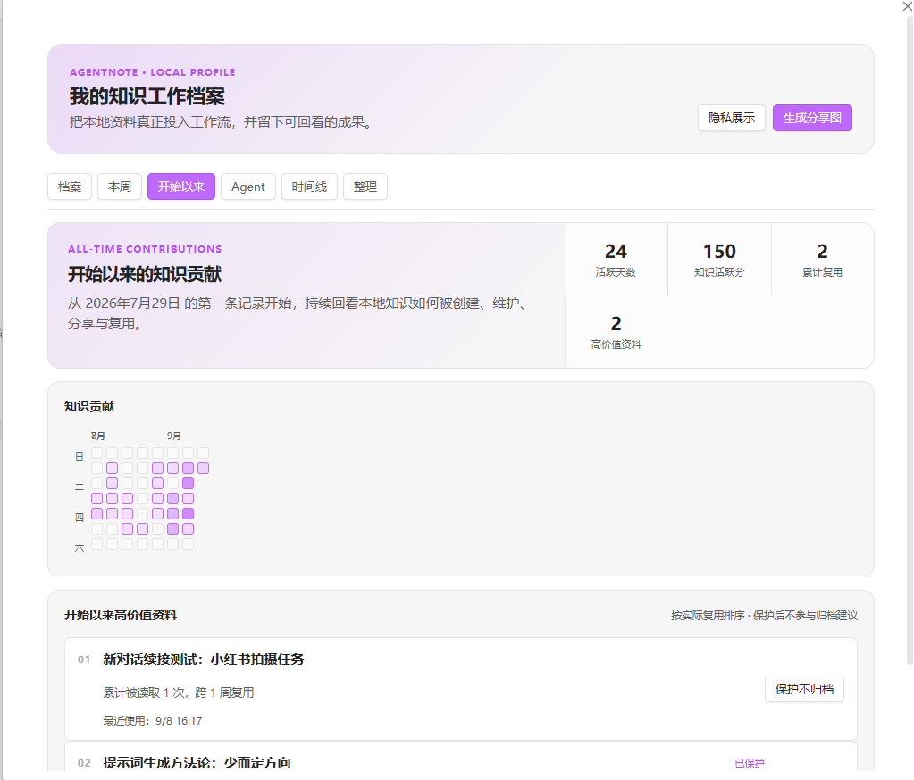

# 如何使用 agentNote

agentNote 的核心流程只有四步：**启动本地服务 → 接入 agent → 分享资料 → 用自然语言继续工作**。

> English copy: [How to Use agentNote](How%20to%20Use.md)

## 开始前

- 使用 Obsidian 桌面端；agentNote 需要本地文件系统和本地 HTTP 服务。
- agent 读取或写入期间保持 Obsidian 打开。
- 第一次只选择一个 agent 和一份文件，不需要先整理整个 vault。

## 第一次完成工作流

### 1. 确认本地服务

从侧边栏图标或命令面板打开 **agentNote 接入台**。在“本地服务”区域确认绿色状态灯和“服务正在运行”；如果未运行，点击 **启动服务**。

服务只监听 `127.0.0.1`，不会把 vault 发布到互联网。

<p align="center">
  
  <br>
  <sub>第 1 步：绿色状态灯表示已接入的 agent 可以访问本地服务。</sub>
</p>

### 2. 接入一个 agent

在“接入 agent”中找到 Claude Code、Codex 或 WorkBuddy，点击 **接入 agentNote**，然后重启该 agent 一次，让它加载新的长期 skill。

未出现在列表中的 agent 可使用 **手动接入任意 agent**：复制生成的任务并发送给目标 agent，它会自行安装并验证长期说明。

<p align="center">
  
  <br>
  <sub>第 2 步：显示“已接入”代表该 agent 已具备 agentNote 使用说明。</sub>
</p>

### 3. 分享一份资料

按需要选择最小且足够的上下文：

| 想分享的内容 | 在 Obsidian 中的操作 |
| --- | --- |
| 文件或文件夹 | 右键目标，选择 **agentNote: 分享给 agent**。 |
| 笔记中的一段文字 | 选中文本后，使用 **agentNote: 分享选中内容**。 |

agentNote 会自动复制本地地址。将完整地址粘贴到与 agent 的对话中。

<p align="center">
  
  <br>
  <sub>第 3 步：直接从文件菜单分享，无需移动、上传或复制原文件。</sub>
</p>

### 4. 说明你希望 agent 做什么

可以直接发送：

```text
请读取这个资料，整理重点、待办和风险：
<粘贴 agentNote 地址>
```

也可以在对话结束后说：

```text
请把这次结论写到 Obsidian，并说明它为什么重要。
```

同一条分享地址始终返回最新内容；agent 写入笔记后会拿到永久地址，以后说“修改刚才那篇”即可继续更新原笔记。

<p align="center">
  
  <br>
  <sub>第 4 步：粘贴地址后，明确总结、审阅、规划或更新等具体目标。</sub>
</p>

## 使用后去哪里看

在接入台点击 **查看完整洞察**，即可回看资料何时被创建、更新、分享和复用；这些活动只保存于本地 vault。

<p align="center">
  
  <br>
  <sub>当工作流开始运转后，用知识档案回看真正被使用的资料。</sub>
</p>

## 常见情况

| 情况 | 先检查什么 |
| --- | --- |
| agent 无法打开地址 | 保持 Obsidian 打开，并确认本地服务正在运行。 |
| agent 不理解“写到笔记里” | 确认它已接入，然后重启该 agent 一次。 |
| agent 未出现在列表 | 使用 **手动接入任意 agent**。 |
| 分享的上下文太多 | 改为分享选中文本，而不是整个文件或文件夹。 |
| 希望资料不出现在归档建议中 | 点击 **保护不归档**；它不会修改内容或分享地址。 |

## 隐私

agentNote 只在本机运行：没有账号、云同步、遥测服务或公网分享入口。每一份可读内容都由你主动选择。
